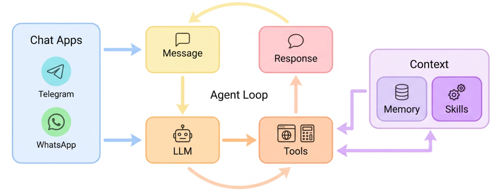

<div align="center">
  
  <h1>nanobot: Ultra-Lightweight Personal AI Assistant</h1>
  <p>
    <a href="https://pypi.org/project/nanobot-ai/"></a>
    <a href="https://pepy.tech/project/nanobot-ai"></a>
    
    
    <a href="./COMMUNICATION.md"></a>
    <a href="./COMMUNICATION.md"></a>
    <a href="https://discord.gg/MnCvHqpUGB"></a>
  </p>
</div>

🐈 **nanobot** is an **ultra-lightweight** personal AI assistant inspired by [Clawdbot](https://github.com/openclaw/openclaw) 

⚡️ Delivers core agent functionality in just **~4,000** lines of code — **99% smaller** than Clawdbot's 430k+ lines.

📏 Real-time line count: **3,423 lines** (run `bash core_agent_lines.sh` to verify anytime)

## 📢 News

- **2026-02-08** 🔧 Refactored Providers — adding a new LLM provider only takes just 2 steps! Check [here](#providers).
- **2026-02-07** 🚀 Released v0.1.3.post5 with Qwen support & several improvements! Check [here](https://github.com/HKUDS/nanobot/releases/tag/v0.1.3.post5) for details.
- **2026-02-06** ✨ Added Moonshot/Kimi provider, Discord integration, and enhanced security hardening!
- **2026-02-05** ✨ Added Feishu channel, DeepSeek provider, and enhanced scheduled tasks support!
- **2026-02-04** 🚀 Released v0.1.3.post4 with multi-provider & Docker support! Check [here](https://github.com/HKUDS/nanobot/releases/tag/v0.1.3.post4) for details.
- **2026-02-03** ⚡ Integrated vLLM for local LLM support and improved natural language task scheduling!
- **2026-02-02** 🎉 nanobot officially launched! Welcome to try 🐈 nanobot!

## Key Features of nanobot:

🪶 **Ultra-Lightweight**: Just ~4,000 lines of core agent code — 99% smaller than Clawdbot.

🔬 **Research-Ready**: Clean, readable code that's easy to understand, modify, and extend for research.

⚡️ **Lightning Fast**: Minimal footprint means faster startup, lower resource usage, and quicker iterations.

💎 **Easy-to-Use**: One-click to deploy and you're ready to go.

## 🏗️ Architecture

<p align="center">
  
</p>

## ✨ Features

<table align="center">
  <tr align="center">
    <th><p align="center">📈 24/7 Real-Time Market Analysis</p></th>
    <th><p align="center">🚀 Full-Stack Software Engineer</p></th>
    <th><p align="center">📅 Smart Daily Routine Manager</p></th>
    <th><p align="center">📚 Personal Knowledge Assistant</p></th>
  </tr>
  <tr>
    <td align="center"><p align="center"></p></td>
    <td align="center"><p align="center"></p></td>
    <td align="center"><p align="center"></p></td>
    <td align="center"><p align="center"></p></td>
  </tr>
  <tr>
    <td align="center">Discovery • Insights • Trends</td>
    <td align="center">Develop • Deploy • Scale</td>
    <td align="center">Schedule • Automate • Organize</td>
    <td align="center">Learn • Memory • Reasoning</td>
  </tr>
</table>

## 📦 Install

**Install from source** (latest features, recommended for development)

```bash
git clone https://github.com/HKUDS/nanobot.git
cd nanobot
pip install -e .
```

**Install with [uv](https://github.com/astral-sh/uv)** (stable, fast)

```bash
uv tool install nanobot-ai
```

**Install from PyPI** (stable)

```bash
pip install nanobot-ai
```

## 🚀 Quick Start

> [!TIP]
> Set your API key in `~/.nanobot/config.json`.
> Get API keys: [OpenRouter](https://openrouter.ai/keys) (Global) · [DashScope](https://dashscope.console.aliyun.com) (Qwen) · [Brave Search](https://brave.com/search/api/) (optional, for web search)

**1. Initialize**

```bash
nanobot onboard
```

**2. Configure** (`~/.nanobot/config.json`)

For OpenRouter - recommended for global users:
```json
{
  "providers": {
    "openrouter": {
      "apiKey": "sk-or-v1-xxx"
    }
  },
  "agents": {
    "defaults": {
      "model": "anthropic/claude-opus-4-5"
    }
  }
}
```

**3. Chat**

```bash
nanobot agent -m "What is 2+2?"
```

That's it! You have a working AI assistant in 2 minutes.

## 🖥️ Local Models (vLLM)

Run nanobot with your own local models using vLLM or any OpenAI-compatible server.

**1. Start your vLLM server**

```bash
vllm serve meta-llama/Llama-3.1-8B-Instruct --port 8000
```

**2. Configure** (`~/.nanobot/config.json`)

```json
{
  "providers": {
    "vllm": {
      "apiKey": "dummy",
      "apiBase": "http://localhost:8000/v1"
    }
  },
  "agents": {
    "defaults": {
      "model": "meta-llama/Llama-3.1-8B-Instruct"
    }
  }
}
```

**3. Chat**

```bash
nanobot agent -m "Hello from my local LLM!"
```

> [!TIP]
> The `apiKey` can be any non-empty string for local servers that don't require authentication.

## 💬 Chat Apps

Talk to your nanobot through Telegram, Discord, WhatsApp, or Feishu — anytime, anywhere.

| Channel | Setup |
|---------|-------|
| **Telegram** | Easy (just a token) |
| **Discord** | Easy (bot token + intents) |
| **WhatsApp** | Medium (scan QR) |
| **Feishu** | Medium (app credentials) |

<details>
<summary><b>Telegram</b> (Recommended)</summary>

**1. Create a bot**
- Open Telegram, search `@BotFather`
- Send `/newbot`, follow prompts
- Copy the token

**2. Configure**

```json
{
  "channels": {
    "telegram": {
      "enabled": true,
      "token": "YOUR_BOT_TOKEN",
      "allowFrom": ["YOUR_USER_ID"]
    }
  }
}
```

> Get your user ID from `@userinfobot` on Telegram.

**3. Run**

```bash
nanobot gateway
```

</details>

<details>
<summary><b>Discord</b></summary>

**1. Create a bot**
- Go to https://discord.com/developers/applications
- Create an application → Bot → Add Bot
- Copy the bot token

**2. Enable intents**
- In the Bot settings, enable **MESSAGE CONTENT INTENT**
- (Optional) Enable **SERVER MEMBERS INTENT** if you plan to use allow lists based on member data

**3. Get your User ID**
- Discord Settings → Advanced → enable **Developer Mode**
- Right-click your avatar → **Copy User ID**

**4. Configure**

```json
{
  "channels": {
    "discord": {
      "enabled": true,
      "token": "YOUR_BOT_TOKEN",
      "allowFrom": ["YOUR_USER_ID"]
    }
  }
}
```

**5. Invite the bot**
- OAuth2 → URL Generator
- Scopes: `bot`
- Bot Permissions: `Send Messages`, `Read Message History`
- Open the generated invite URL and add the bot to your server

**6. Run**

```bash
nanobot gateway
```

</details>

<details>
<summary><b>WhatsApp</b></summary>

Requires **Node.js ≥18**.

**1. Link device**

```bash
nanobot channels login
# Scan QR with WhatsApp → Settings → Linked Devices
```

**2. Configure**

```json
{
  "channels": {
    "whatsapp": {
      "enabled": true,
      "allowFrom": ["+1234567890"]
    }
  }
}
```

**3. Run** (two terminals)

```bash
# Terminal 1
nanobot channels login

# Terminal 2
nanobot gateway
```

</details>

<details>
<summary><b>Feishu (飞书)</b></summary>

Uses **WebSocket** long connection — no public IP required.

```bash
pip install nanobot-ai[feishu]
```

**1. Create a Feishu bot**
- Visit [Feishu Open Platform](https://open.feishu.cn/app)
- Create a new app → Enable **Bot** capability
- **Permissions**: Add `im:message` (send messages)
- **Events**: Add `im.message.receive_v1` (receive messages)
  - Select **Long Connection** mode (requires running nanobot first to establish connection)
- Get **App ID** and **App Secret** from "Credentials & Basic Info"
- Publish the app

**2. Configure**

```json
{
  "channels": {
    "feishu": {
      "enabled": true,
      "appId": "cli_xxx",
      "appSecret": "xxx",
      "encryptKey": "",
      "verificationToken": "",
      "allowFrom": []
    }
  }
}
```

> `encryptKey` and `verificationToken` are optional for Long Connection mode.
> `allowFrom`: Leave empty to allow all users, or add `["ou_xxx"]` to restrict access.

**3. Run**

```bash
nanobot gateway
```

> [!TIP]
> Feishu uses WebSocket to receive messages — no webhook or public IP needed!

</details>

## ⚙️ Configuration

Config file: `~/.nanobot/config.json`

### Providers

> [!NOTE]
> Groq provides free voice transcription via Whisper. If configured, Telegram voice messages will be automatically transcribed.

| Provider | Purpose | Get API Key |
|----------|---------|-------------|
| `openrouter` | LLM (recommended, access to all models) | [openrouter.ai](https://openrouter.ai) |
| `anthropic` | LLM (Claude direct) | [console.anthropic.com](https://console.anthropic.com) |
| `openai` | LLM (GPT direct) | [platform.openai.com](https://platform.openai.com) |
| `deepseek` | LLM (DeepSeek direct) | [platform.deepseek.com](https://platform.deepseek.com) |
| `groq` | LLM + **Voice transcription** (Whisper) | [console.groq.com](https://console.groq.com) |
| `gemini` | LLM (Gemini direct) | [aistudio.google.com](https://aistudio.google.com) |
| `aihubmix` | LLM (API gateway, access to all models) | [aihubmix.com](https://aihubmix.com) |
| `dashscope` | LLM (Qwen) | [dashscope.console.aliyun.com](https://dashscope.console.aliyun.com) |
| `moonshot` | LLM (Moonshot/Kimi) | [platform.moonshot.cn](https://platform.moonshot.cn) |
| `zhipu` | LLM (Zhipu GLM) | [open.bigmodel.cn](https://open.bigmodel.cn) |
| `vllm` | LLM (local, any OpenAI-compatible server) | — |

<details>
<summary><b>Adding a New Provider (Developer Guide)</b></summary>

nanobot uses a **Provider Registry** (`nanobot/providers/registry.py`) as the single source of truth.
Adding a new provider only takes **2 steps** — no if-elif chains to touch.

**Step 1.** Add a `ProviderSpec` entry to `PROVIDERS` in `nanobot/providers/registry.py`:

```python
ProviderSpec(
    name="myprovider",                   # config field name
    keywords=("myprovider", "mymodel"),  # model-name keywords for auto-matching
    env_key="MYPROVIDER_API_KEY",        # env var for LiteLLM
    display_name="My Provider",          # shown in `nanobot status`
    litellm_prefix="myprovider",         # auto-prefix: model → myprovider/model
    skip_prefixes=("myprovider/",),      # don't double-prefix
)
```

**Step 2.** Add a field to `ProvidersConfig` in `nanobot/config/schema.py`:

```python
class ProvidersConfig(BaseModel):
    ...
    myprovider: ProviderConfig = ProviderConfig()
```

That's it! Environment variables, model prefixing, config matching, and `nanobot status` display will all work automatically.

**Common `ProviderSpec` options:**

| Field | Description | Example |
|-------|-------------|---------|
| `litellm_prefix` | Auto-prefix model names for LiteLLM | `"dashscope"` → `dashscope/qwen-max` |
| `skip_prefixes` | Don't prefix if model already starts with these | `("dashscope/", "openrouter/")` |
| `env_extras` | Additional env vars to set | `(("ZHIPUAI_API_KEY", "{api_key}"),)` |
| `model_overrides` | Per-model parameter overrides | `(("kimi-k2.5", {"temperature": 1.0}),)` |
| `is_gateway` | Can route any model (like OpenRouter) | `True` |
| `detect_by_key_prefix` | Detect gateway by API key prefix | `"sk-or-"` |
| `detect_by_base_keyword` | Detect gateway by API base URL | `"openrouter"` |
| `strip_model_prefix` | Strip existing prefix before re-prefixing | `True` (for AiHubMix) |

</details>


### Security

> [!TIP]
> For production deployments, set `"restrictToWorkspace": true` in your config to sandbox the agent.

| Option | Default | Description |
|--------|---------|-------------|
| `tools.restrictToWorkspace` | `false` | When `true`, restricts **all** agent tools (shell, file read/write/edit, list) to the workspace directory. Prevents path traversal and out-of-scope access. |
| `channels.*.allowFrom` | `[]` (allow all) | Whitelist of user IDs. Empty = allow everyone; non-empty = only listed users can interact. |


## CLI Reference

| Command | Description |
|---------|-------------|
| `nanobot onboard` | Initialize config & workspace |
| `nanobot agent -m "..."` | Chat with the agent |
| `nanobot agent` | Interactive chat mode |
| `nanobot gateway` | Start the gateway |
| `nanobot status` | Show status |
| `nanobot channels login` | Link WhatsApp (scan QR) |
| `nanobot channels status` | Show channel status |

<details>
<summary><b>Scheduled Tasks (Cron)</b></summary>

```bash
# Add a job
nanobot cron add --name "daily" --message "Good morning!" --cron "0 9 * * *"
nanobot cron add --name "hourly" --message "Check status" --every 3600

# List jobs
nanobot cron list

# Remove a job
nanobot cron remove <job_id>
```

</details>

## 🐳 Docker

> [!TIP]
> The `-v ~/.nanobot:/root/.nanobot` flag mounts your local config directory into the container, so your config and workspace persist across container restarts.

Build and run nanobot in a container:

```bash
# Build the image
docker build -t nanobot .

# Initialize config (first time only)
docker run -v ~/.nanobot:/root/.nanobot --rm nanobot onboard

# Edit config on host to add API keys
vim ~/.nanobot/config.json

# Run gateway (connects to Telegram/WhatsApp)
docker run -v ~/.nanobot:/root/.nanobot -p 18790:18790 nanobot gateway

# Or run a single command
docker run -v ~/.nanobot:/root/.nanobot --rm nanobot agent -m "Hello!"
docker run -v ~/.nanobot:/root/.nanobot --rm nanobot status
```

## 📁 Project Structure

```
nanobot/
├── agent/          # 🧠 Core agent logic
│   ├── loop.py     #    Agent loop (LLM ↔ tool execution)
│   ├── context.py  #    Prompt builder
│   ├── memory.py   #    Persistent memory
│   ├── skills.py   #    Skills loader
│   ├── subagent.py #    Background task execution
│   └── tools/      #    Built-in tools (incl. spawn)
├── skills/         # 🎯 Bundled skills (github, weather, tmux...)
├── channels/       # 📱 WhatsApp integration
├── bus/            # 🚌 Message routing
├── cron/           # ⏰ Scheduled tasks
├── heartbeat/      # 💓 Proactive wake-up
├── providers/      # 🤖 LLM providers (OpenRouter, etc.)
├── session/        # 💬 Conversation sessions
├── config/         # ⚙️ Configuration
└── cli/            # 🖥️ Commands
```

## 🤝 Contribute & Roadmap

PRs welcome! The codebase is intentionally small and readable. 🤗

**Roadmap** — Pick an item and [open a PR](https://github.com/HKUDS/nanobot/pulls)!

- [x] **Voice Transcription** — Support for Groq Whisper (Issue #13)
- [ ] **Multi-modal** — See and hear (images, voice, video)
- [ ] **Long-term memory** — Never forget important context
- [ ] **Better reasoning** — Multi-step planning and reflection
- [ ] **More integrations** — Discord, Slack, email, calendar
- [ ] **Self-improvement** — Learn from feedback and mistakes

### Contributors

<a href="https://github.com/HKUDS/nanobot/graphs/contributors">
  
</a>


## ⭐ Star History

<div align="center">
  <a href="https://star-history.com/#HKUDS/nanobot&Date">
    <picture>
      <source media="(prefers-color-scheme: dark)" srcset="https://api.star-history.com/svg?repos=HKUDS/nanobot&type=Date&theme=dark" />
      <source media="(prefers-color-scheme: light)" srcset="https://api.star-history.com/svg?repos=HKUDS/nanobot&type=Date" />
      
    </picture>
  </a>
</div>

<p align="center">
  <em> Thanks for visiting ✨ nanobot!</em><br><br>
  
</p>


<p align="center">
  <sub>nanobot is for educational, research, and technical exchange purposes only</sub>
</p>
